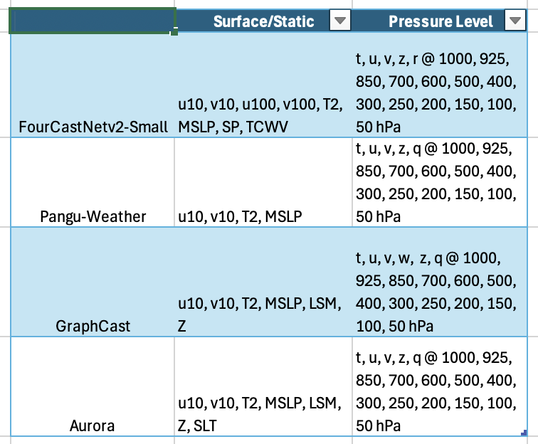

# ai-models-navgem

This package is based on ECMWF's ai-models package, adding an option to initialize with NAVGEM data. Use the command `ai-models-navgem` to run AI-based weather forecasting models in place of the standard `ai-models` demonstrated in ECMWF's directions below. These models need to be installed independently.

## Modifications

The key additions over the standard `ai-models` package is a navgem.py file in ./ai-models-navgem/src/ai_models_navgem/inputs/ which helps to properly formats pre-downloaded NAVGEM data. After this, it primarily uses the standard functionality of `ai-models` to run the models.

**I could not locate some NAVGEM data required to run some models. Namely, "tcwv","100u","100v" are filled with zeros to make things work for now. The land-sea mask and geopotential at the surface (orography) are filled in with ERA5 sample data (they are static fields).** 

Required variables:  


## Usage

Most functionality is the same as the original [`ai-models`](https://github.com/ecmwf-lab/ai-models) package and we refer the user there for most options. Replace the --input argument with navgem. The 0.50 deg NAVGEM conditions are bi-linearly interpolated to a 0.25 deg grid under the hood.

I've included a Python script (dl.py) that downloads sample NAVGEM data, concatenates it, and places it in the proper location for `ai-models-navgem` to retrieve it.

Here are instructions for setting everything up and doing some test runs:

git clone https://github.com/jacob-t-radford/ai-models-navgem.git  
git clone https://github.com/jacob-t-radford/ai-models-fourcastnetv2-navgem.git  
git clone https://github.com/jacob-t-radford/ai-models-panguweather-navgem.git  
git clone https://github.com/jacob-t-radford/ai-models-graphcast-navgem.git  
git clone https://github.com/jacob-t-radford/ai-models-aurora-navgem.git  

**Install Anaconda3 if not already**

conda create --name ai-models-navgem python==3.11  

cd ai-models-navgem  
pip install -e .  

cd ai-models-fourcastnetv2-navgem  
pip install -e .  

cd ai-models-panguweather-navgem  
pip install -e .  

cd ai-models-graphcast-navgem  
pip install -e .  

cd ai-models-aurora-navgem  
pip install -e .  

pip install git+https://github.com/deepmind/graphcast.git  
pip install jax[cuda12]==0.5.3  
pip install dm-haiku==0.0.13  
pip install metpy  
pip install beautifulsoup4  

aws s3 cp --recursive --no-sign-request s3://noaa-oar-mlwp-data/colab_resources/fcnv2 ./ai-models-navgem/fcnv2/  
aws s3 cp --recursive --no-sign-request s3://noaa-oar-mlwp-data/colab_resources/pw ./ai-models-navgem/pw/  
aws s3 cp --recursive --no-sign-request s3://noaa-oar-mlwp-data/colab_resources/gc ./ai-models-navgem/gc/  
aws s3 cp --recursive --no-sign-request s3://noaa-oar-mlwp-data/colab_resources/au ./ai-models-navgem/au/  
aws s3 cp --no-sign-request s3://noaa-oar-mlwp-data/colab_resources/sample_pres.grib ./ai-models-navgem/src/ai_models_navgem/inputs/  
aws s3 cp --no-sign-request s3://noaa-oar-mlwp-data/colab_resources/sample_sfc.grib ./ai-models-navgem/src/ai_models_navgem/inputs/  

python dl.py 2025 05 06 00  
python dl.py 2025 05 05 18 (Need previous initialization for GraphCast)  


**Replace with path to your anaconda environment**  
export LD_LIBRARY_PATH=.../anaconda3/envs/ai-models-navgem/lib/python3.11/site-packages/nvidia/cudnn/lib  

ai-models-navgem --input navgem --date 20250506 --time 0000 --assets ./fcnv2 --path ./2025050600.grib fourcastnetv2-small  
ai-models-navgem --input navgem --date 20250506 --time 0000 --assets ./pw --path ./2025050600.grib panguweather  
ai-models-navgem --input navgem --date 20250506 --time 0000 --assets ./gc --path ./2025050600.grib graphcast  
ai-models-navgem --input navgem --date 20250506 --time 0000 --assets ./au --path ./2025050600.grib aurora --model-version 0.25-finetuned  

## License

```
Copyright 2022, European Centre for Medium Range Weather Forecasts.

Licensed under the Apache License, Version 2.0 (the "License");
you may not use this file except in compliance with the License.
You may obtain a copy of the License at

    http://www.apache.org/licenses/LICENSE-2.0

Unless required by applicable law or agreed to in writing, software
distributed under the License is distributed on an "AS IS" BASIS,
WITHOUT WARRANTIES OR CONDITIONS OF ANY KIND, either express or implied.
See the License for the specific language governing permissions and
limitations under the License.
